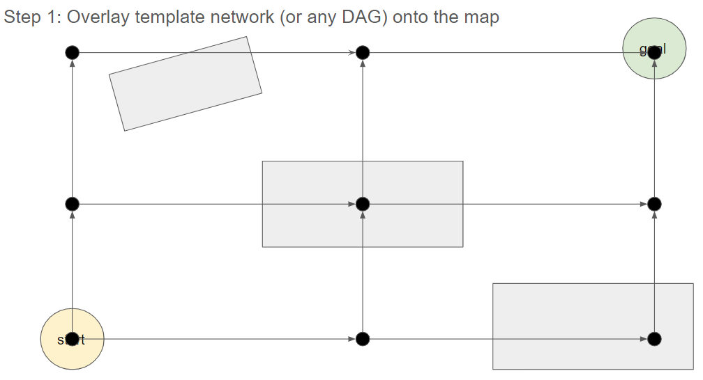
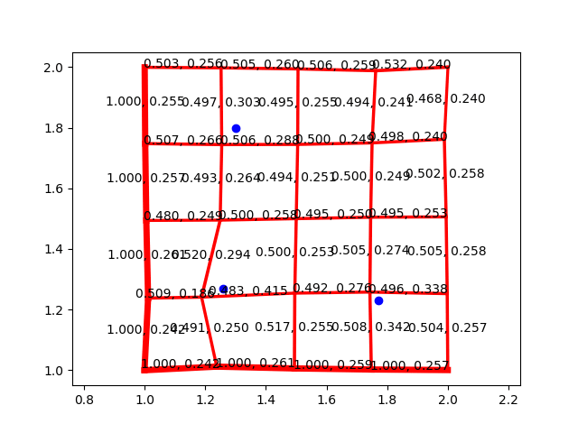

# OptimizationBasedPlanning

Authors: Kevin Liu, David Feng, Stephanie Wang

This project is a planning algorithm in development. Traditional planning techniques for mobile robots and manipulators involve discretizing continuous space into a graph and running discrete graph search algorithms on that graph. This often forces a tradeoff between resolution and time/space complexity. While the graph search techniques guarantee optimality given this discretization, the discretization might only produce suboptimal paths with respect to the continuous space.

Our proposed method formulates the planning problem as a 

## Problem Formulation
The first contribution of this algorithm is to construct the graph in continuous space and define the planning problem as a continuous optimization problem. At this stage of development, we are solving a two-dimensional problem. Our obstacles are defined as positive cost functions, and edges are lines through 2D space.

Each edge has an associated environmental cost and travel cost:

- Environmental cost: This is the sum of line integrals of all obstacle cost functions from the starting vertex to the end vertex.
- Travel cost:  This is simply the L2 distance from the start vertex to the end vertex.

We want to minimize the total square environmental cost and square travel cost of each path. Each path is defined as a linked series of edges that start at a start coordinate and end at the goal coordinate.

The problem formulation is similar to LQR in that we are trying to minimize the total square cost defined over a series of interdependent nodes. There are two important differences:

- LQR uses a first-order Markov model, meaning a linear Bayes network. Our method uses a more complex Bayes net structure
- LQR defines state error with respect to the state represented by a node, and the actuation cost with respect to the state transition represented by an edge. Both of our cost functions are defined wrt edges. Instead of state error, we use a line integral of obstacle cost functions. In LQR we assume that the path from one state to another is unobstructed. However, since we are planning, that is not guaranteed, and we must account for potential obstacles all along the edge.

## Graph Construction

The graph construction stage is where we define all the paths through the environment that we will consider in the planning process. The exact details of how graph construction is done does not matter. This step is similar in spirit to sampling-based planning methods like PRM: we just want to get at least one path from start to the goal. If those paths are suboptimal, that is perfectly fine.

Our approach is to overlay a simple lattice over the environment. The graph expands out in a Pascal triangle-esque pyramid, then constracts onto the goal. The following graphic is a rough illustration of the resulting graph.

Any method that creates paths from the start to the goal will suffice here. For the optimization we only need to know each node position and common nodes between paths.

## Graph Optimization

We minimize the environmental and travel costs for each path wrt the node positions. All nodes except the nodes at the start and goal positions are optimization parameters. For this step, we experimented with using gradient descent and Levenberg-Marquadt optimizers. While we found Levenberg-Marquadt to converge more quickly on toy problems. For the purposes of the next portion of the algorithm, we use gradient descent instead.

## Planning and Edge Selection

So far, the algorithm performs trajectory optimization for all paths. This can be visualized as a "tightening" of the graph around obstacle points. However, to turn this algorithm into a planning method, we must select one of the paths. Here, we run into a problem. Once we do select a path and relax the node dependencies for the other paths, the optimization may then proceed further to reduce the cost of the chosen path. When we chose different paths, the optimized cost of that path alone will be different. We must simultaneously solve the path planning problem (which path to use?) and the trajectory optimization problem (what are the best parameters to minimize the cost of this path?).

We take a page from [Differentiable Architecture Search (2019)](https://arxiv.org/abs/1806.09055). We assign a weight parameter to each edge. The cost of a path is then the sum of the weighted sum of the edge cost of each edge along the path. The algorithm then does bilevel optimization, iteratively optimizing the node positions, then the edge weights.

Intuitively, this is what the algorithm does: the node positions are shifted to reduce the overall cost of all paths in the graph. Then, we increase the weights of edges along lower-cost paths. This increases the importance of these edge weights to the path costs. During the next graph optimization, these edges will be prioritized more when shifting the node positions.

As we converge, we extract the final path by backtracking from the goal node. At each node, we pick the edge with the higher weight.

## Results
We ran our algorithm on an example problem. The start position is (1, 1) and the goal position is (2, 2). The blue points mark the obstacles at (1.77, 1.23), (1.26, 1.27) and (1.3, 1.8). The red lines are the edges of the graph. The width of the edge corresponds to the edge's weight. Over each edge are two numbers: edge weight, edge cost.

## Future work
- CUDA Acceleration: One of the main benefits of solving the planning problem using optimization is to take advantage of recent advances in parallel computation. Traditionally, graph search-based planning runs sequentially and are difficult to parallelize. While the current implementation on Numpy running on the CPU is painfully slow, a CUDA implementation running on a GPU could possibly be competitive with traditional methods.
- Obstacle cost function and edge curve function design: For this toy problem, the obstacle cost function and edge parametrization have been kept very simple. This is due to the difficulty of computing line integrals. This is a big limiting factor to the power of the method. If line integrals of a differentiable cost function over car curves (bicycle model) could be computed, this planner can be used to plan "racing lines" for non-holonomic robots like autonomous vehicles. Encoding the kinodynamic constraints in the edge curve function will make this planner a very powerful tool for complex mobile robots.
- Optimizer design: You might have noticed an artifact in the previous toy problem, the nodes on the left and right ends of the lattice do not "squeeze in" as quickly as the other nodes. This is likely due to the fact that only one path runs through those nodes, resulting in a weak gradient signal. This and other issues could be remedied by switching from vanilla GD to something like Adam, which incorporates momentum and second-moment estimation and preconditioning.
- Edge pruning: As seen in the above example, the edge weights appear to converge slowly after 300 iterations. One option to speed up convergence is to greedily prune edges with weights below a threshold, at the expense of suboptimal results.

## Notes
The code includes a solve function that uses Levenberg-Marquadt for graph optimization. This was discontinued because the edge weight optimization step would require differentiation wrt to the preconditioning matrix. This takes the form (A + lambda * I) for LM. The math in the code does differentiation for Gauss Newton only. This mistake was realized too late, and the function is now defunct. It is not advisable to use a Gauss Newton optimizer for this problem. The use of a barrier function means that as the nodes converge close to obstacles, the problem becomes less and less smooth, meaning Gauss Newton may diverge.

Another nail in the coffin for second-order methods is that for bigger problems, our matrix inversion would become very expensive. Depending on the graph construction method, the preconditioning matrix could be dense (as it is for our lattice), which rules out sparse methods. This means that the solver could be stuck with O(n^3) iterations for an n node graph.

This is ultimately why we resorted to GD as our optimizer.